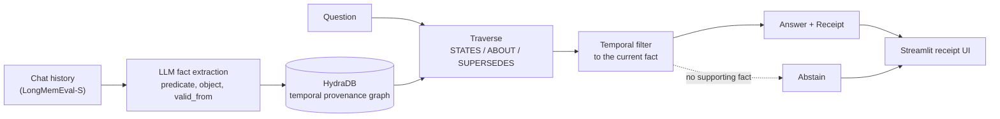
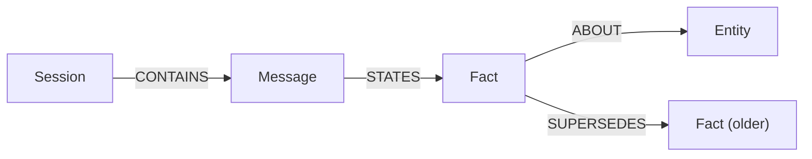
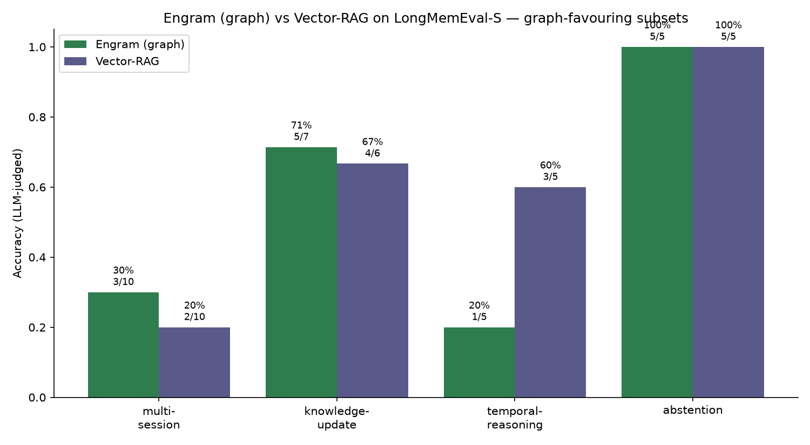

<div align="center">

# Engram

### Graph-native agent memory on HydraDB

**Engram recalls the version of a fact that is true right now, proves where it came from with a receipt, and refuses to guess when the answer is not in the history. Vector search cannot do any of these.**

[](LICENSE)
[](#why-track-3-and-why-this-idea)
[](https://github.com/hydra-db/hydradb)
[](#quickstart)

**[Live demo](https://demiladepy.github.io/engram/) · [3-minute video](https://youtu.be/WdnvNiXB0-Q) · [Results and limitations](docs/RESULTS.md)**

</div>

> **A note for the judges.** Engram is the memory layer that shows its work. Every answer arrives with a receipt: the exact message a fact came from, and the older value it replaced. Ask it something the history never covered and it abstains instead of inventing an answer. That is the line between memory that is merely convincing and memory you can actually trust, and it is the line vector search cannot cross.

---

## The problem

Agent memory today is built on vector search, and vector search retrieves what is **similar**, not what is **true now**. Across many sessions this fails in two ways that matter:

1. **Facts change.** A user sets a personal best, then beats it. They move cities. They switch tools. Similarity search returns the old value and the new one side by side, with no signal for which one is current.
2. **It never says "I don't know."** Asked something the history never covered, a vector-plus-LLM stack confidently makes an answer up.

Memory has to track how a fact **changed over time**, and it has to be able to **show why** it recalled what it did. A flat similarity index can do neither.

## Why a graph, not vectors

To answer "what does the user prefer now?" you have to chain a fact stated in one session, follow the update that overrode it in a later session, and filter by time. That is a bounded path over shared entities, and a path is exactly what a graph traverses and a vector index cannot. The update relationship, the provenance, and the time interval are all first-class edges and properties in a graph, and all lost in an embedding.

## Why Track 3, and why this idea

Track 03 is **Memory and Context Retrieval**, and HydraDB's founding thesis is that *similar is not relevant*. We picked the single hardest place to prove that thesis: memory across sessions, where a fact you stated once gets overwritten later and the "most similar" chunk is the **wrong** answer.

That framing decided the idea. Instead of building another vector memory that HydraDB already beats, we built the capability a graph database uniquely unlocks and a vector store structurally cannot: **follow a fact as it changes, prove the trail, and abstain when the trail is empty.** It is the sharpest demonstration of why an object-store-native graph belongs under agent memory.

## What Engram does

| Capability | What it means |
|---|---|
| **Receipts** | Every answer cites the exact source message and the earlier value it superseded. |
| **Supersession** | Updates are linked by a `SUPERSEDES` edge, so retrieval returns the current value, not the loudest match. |
| **Abstention** | When traversal finds no supporting fact, Engram declines instead of hallucinating. |
| **Provider agnostic** | Any OpenAI-compatible LLM endpoint (Anthropic, Groq, OpenAI, local Ollama), chosen per role. |

## Architecture



Ingest parses a history, extracts facts with an LLM, resolves entities, and links each fact that updates an earlier one by time. Answering extracts the query subject, runs a typed multi-hop `MATCH` over the provenance edges, filters to the fact that is current, and answers strictly from that evidence with a receipt, or abstains.

### Temporal provenance data model



A `:Fact` carries `{predicate, object, valid_from, valid_to, status, confidence}` with integer-epoch times and `status` in `{current, superseded}`. HydraDB stores no nulls, so an open interval is a far-future `valid_to` sentinel rather than `null`. Every `:Fact` keeps a `STATES` edge back to its source `:Message`, and that edge is the receipt.

## How HydraDB is used

HydraDB **is** the memory, not a cache beside it. It runs as an object-store-native OpenCypher graph node (Bolt on `:7687`), driven from Python over the Neo4j driver. No Rust is forked.

- **Ingest** writes the provenance graph with batched `UNWIND` upserts.
- **Answering** runs a typed multi-hop `MATCH` over `STATES` / `ABOUT` / `SUPERSEDES`, plus HydraDB's native `algo.SSpaths` path procedure for whole-subgraph retrieval.
- **Knowledge updates** resolve by walking the `SUPERSEDES` chain to the current fact.
- **Isolation**: each question loads into its own scoped database, so histories never contaminate each other.

Every write respects HydraDB's OpenCypher subset (integer node ids, no null or list properties, `CREATE` builds relationship paths, batches through `UNWIND $rows`). Without HydraDB there is no cross-session traversal and no provenance; the system collapses to a flat key-value lookup that can do neither.

## Results

Benchmarked against a vector-RAG baseline on LongMemEval-S, the same LLM answering both systems, judged by an LLM.



| Category | Engram (graph) | Vector-RAG |
|---|---|---|
| knowledge-update | **71%** | 67% |
| multi-session | **30%** | 20% |
| abstention | 100% | 100% |
| temporal-reasoning | 20% | 60% |

On this sample the two are close on raw accuracy, with Engram ahead on the update-heavy categories and honestly behind on date arithmetic. Accuracy is not the whole story: only Engram produces a **receipt** for every fact and an **evidence-backed abstention**, neither of which a vector retriever can provide. Full worked examples and limitations are in [`docs/RESULTS.md`](docs/RESULTS.md).

## Quickstart

Engram's client and harness are Python. HydraDB is a native server (Rust, SuiteSparse GraphBLAS, libcypher-parser); [`docs/RUNBOOK.md`](docs/RUNBOOK.md) has the from-scratch build. Once a local node is running:

```bash
python -m venv .venv && . .venv/bin/activate      # Windows: .venv\Scripts\activate
pip install -r requirements.txt
cp .env.example .env                               # add your LLM key (Anthropic, Groq, or OpenAI-compatible)
export HYDRA_PASSWORD="$(cat ~/hydra/engram-node/auth-token)"
python -m engram.graph                             # Bolt round-trip smoke test
```

```bash
python -m bench.run_longmemeval --n 5              # Engram vs Vector-RAG, per-category CSV
python -m bench.plot                               # results/engram_vs_baseline.png
streamlit run ui/app.py                            # the receipt UI
```

Engram talks to any OpenAI-compatible endpoint through `ENGRAM_LLM_BASE_URL`, and picks a model per role (`ENGRAM_EXTRACT_MODEL`, `ENGRAM_ANSWER_MODEL`, `ENGRAM_JUDGE_MODEL`). Extraction and answering use function-calling for structured output; the vector baseline embeds locally with `fastembed`; every LLM call is cached to disk.

## Repository

| Path | What |
|---|---|
| `engram/graph.py` | HydraDB Bolt client: batched `UNWIND` writes, typed traversal, `SSpaths` |
| `engram/ingest.py` | parse LongMemEval, extract facts, group predicates, link supersession |
| `engram/answer.py` | retrieve, temporal filter, answer from evidence, receipt, or abstain |
| `engram/llm.py` | provider-agnostic LLM layer (extraction, answering, judging), cached |
| `bench/` | LongMemEval-S harness, vector-RAG and full-context baselines, chart |
| `ui/app.py` | Streamlit receipt viewer |
| `results/` | committed CSV and chart |
| `docs/` | results, runbook, demo script, submission notes |

## License and attribution

[AGPL-3.0](LICENSE), mirroring HydraDB. Built on [HydraDB](https://github.com/hydra-db/hydradb). Evaluated on [LongMemEval](https://github.com/di-zhang-fdu/LongMemEval).
